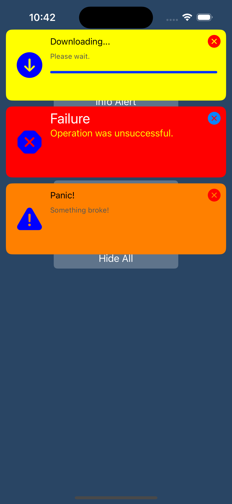

# APPPlainAlert
 The creeping message that enters the queue can be adjusted and customized from above or below
 
Notification message is fully customizable
Original Code from here https://github.com/josshad/EHPlainAlert





## Example Success Alert
````Swift  
  @IBAction func successAlert(_ sender: UIButton) {
	let alert = APPlainAlert(title: "Success!!!!", message: "Something works! Lorem ipsum!", type: .success)
	alert.messageColor = .green
	alert.show()
}
````

## Example Info Alert
````Swift  
@IBAction func infoAlert(_ sender: UIButton) {
	let alert = APPlainAlert(title: "Info", message: "This is an info message.", type: .info)
	alert.messageColor = .blue
	alert.iconColor = .cyan
	alert.shouldShowCloseIcon = true
	alert.delegate = self
	alert.hiddenDelay = 5.0
	alert.show()
}
````

## Example Fail Alert
````Swift  
@IBAction func failureAlert(_ sender: UIButton) {
	let alert = APPlainAlert(title: "Failure", message: "Operation was unsuccessful.", type: .error)
	alert.messageColor = .red
	alert.closeButtonColor = .systemBlue
	alert.titleFont = .systemFont(ofSize: 24)
	alert.subTitleFont = .systemFont(ofSize: 16)
	alert.titleColor = .white // Címsor színének beállítása fehérre
	alert.subtitleColor = .yellow // Alszöveg színének beállítása sárgára
	alert.show()
}

````

## Example Progres Alert
````Swift  
  @IBAction func progressAlert(_ sender: UIButton) {
	progressAlert = APPlainAlert(title: "Downloading...", message: "Please wait.", type: .progress)
	progressAlert?.messageColor = .yellow
	progressAlert?.hiddenDelay = 100.0
	progressAlert?.delegate = self
	progressAlert?.show()

	downloadFile()
}
````
## Example Panic Alert
````Swift  
@IBAction func panicAlert(_ sender: UIButton) {
	let alert = APPlainAlert(title: "Panic!", message: "Something broke!", type: .panic)
	alert.messageColor = .orange
	alert.show()
}

````

## Example Alert Open Safari info
````Swift  
 @IBAction func infoWithSafari(_ sender: Any) {
	let alert = APPlainAlert(title: "Hmm...", message: "Tap for information", type: .info)
	alert.action = {
		if let url = URL(string: "https://appsyscode.com"), UIApplication.shared.canOpenURL(url) {
			UIApplication.shared.open(url, options: [:], completionHandler: nil)
		}
	}
	alert.messageColor = .purple
	alert.show()
}
````
## Author

appsyscode, info@appsyscode.com

## License

APPPAlert is available under the MIT license. See the LICENSE file for more info.
